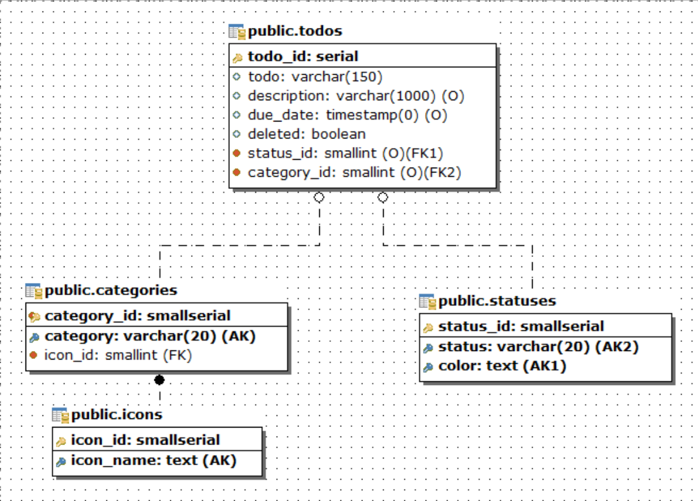

# Схема данных

Схема данных представлена на рисунке:

Исходя из схемы данных можно составить список ограничений, которые необходимо реализовать в redux:

Icons:

-   обязан присутствовать id типа number
-   обязан присутствовать name

Statuses:

-   обязан присутствовать id типа number
-   обязан присутствовать ststus
-   обязан присутствовать color

Category:

-   обязан присутствовать id типа number
-   обязано присутствовать название категории
-   длина названия Category не должна превышать 20 символов
-   нельзя удалять Category если есть todo, у которого установлен category_id равный id, удаляемой категории

Todos:

-   обязан присутствовать id типа number
-   обязан присутствовать status_id типа number
-   длина todo не должна превышать 150 символов
-   длина description не должна превышать 1000 символов или undefined
-   у нового Todo поле completed должно быть установлено в false
-   у нового Todo поле deleted должно быть установлено в false

На базе схемы данных составим описание типов сех сущностей в `entities.d.ts`:
